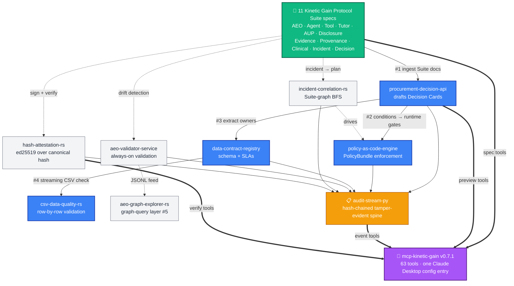
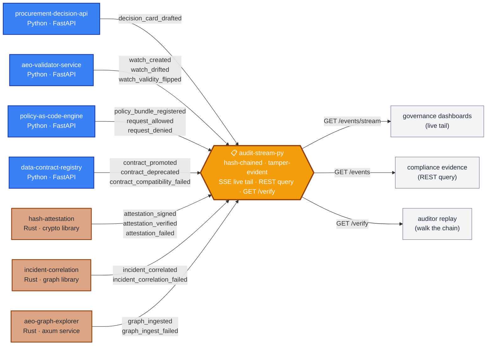

# Miz Causevic

> **Engineering · Platform Architecture · B2B SaaS Technologist**
> Boston, MA · ~30 years across IBM, CyberArk, Alteryx, Digital.ai, Gryphon.ai

I build the systems that sit between traffic, revenue, and the teams that operate them. Platform engineering, GTM systems, traffic integrity, digital intelligence, AI governance. **I also author open specifications for the answer-engine era — and a fifteen-repo implementation stack that consumes them** ([Suite × Implementations](https://github.com/mizcausevic-dev/kinetic-gain-protocol-suite#-suite--implementations)). Polyglot by choice: the language fits the problem, not the resume.

**Publication note:** many of the repos below were published in a concentrated May 2026 portfolio sprint. The dates reflect public packaging, CI, screenshots, and repo hardening, not the first moment the ideas or workstreams existed.

### 📡 Current expansion lane

The current public wave now spans **revenue systems, traffic integrity, web-platform reliability, regulated workflow operations, and multi-cloud identity & platform governance**:

- `GTM Systems & Growth` — demand-gen automation, CRM routing, lifecycle control, offer motion
- `Traffic Integrity` — bot mitigation, click-fraud reduction, clean analytics inputs
- `Digital Intelligence` — attribution, telemetry, SEO governance, pipeline clarity
- `Platform Engineering` — headless CMS, DevOps, core web vitals, resilient delivery
- `Regulated Workflow Systems` — approval routing, obligation graphs, consent evidence, audit posture
- `Operational Command Surfaces` — bookings, creator launches, menu sync, store incidents, permits, crop compliance
- `Cloud Identity, Platform, FinOps & Threat Detection` — operator surfaces for Microsoft (Entra access reviews, Intune device compliance, M365 Purview retention), AWS (IAM Access Analyzer + GuardDuty triage), GCP (IAM policy drift + billing-anomaly routing), and Azure (landing-zone drift). Each is a synthetic-data operator console at production hardness — AGPL-3.0-or-later, dual-Node CI, dependabot, 95%+ coverage, deployed on its own kineticgain.com subdomain.

Early anchors in that lane:
- [`revops-lead-router`](https://github.com/mizcausevic-dev/revops-lead-router) — control plane for lead enrichment, CRM routing, speed-to-lead posture, and queue integrity
- [`fraud-click-filter`](https://github.com/mizcausevic-dev/fraud-click-filter) · [`cf-bot-shield-tf`](https://github.com/mizcausevic-dev/cf-bot-shield-tf) · [`honeypot-form-validator`](https://github.com/mizcausevic-dev/honeypot-form-validator) · [`anomaly-log-hunter`](https://github.com/mizcausevic-dev/anomaly-log-hunter) — traffic-integrity layer for blocking fraudulent sessions before they burn ad spend or poison analytics
- [`dbt-multi-touch-attr`](https://github.com/mizcausevic-dev/dbt-multi-touch-attr) · [`gtm-datalayer-standards`](https://github.com/mizcausevic-dev/gtm-datalayer-standards) · [`seo-vital-monitor`](https://github.com/mizcausevic-dev/seo-vital-monitor) · [`pipeline-velocity-dash`](https://github.com/mizcausevic-dev/pipeline-velocity-dash) — digital-intelligence layer for attribution, signal clarity, and route-level performance posture
- [`offer-ladder-engine`](https://github.com/mizcausevic-dev/offer-ladder-engine) — offer-path and conversion-state control for pricing and package motion
- [`edge-redirect-manager`](https://github.com/mizcausevic-dev/edge-redirect-manager) · [`headless-wp-vue-starter`](https://github.com/mizcausevic-dev/headless-wp-vue-starter) — web-platform layer for headless CMS delivery, route migration, preview-safe rendering, and SEO-conscious frontend architecture
- [`regulatory-comment-intelligence-hub`](https://github.com/mizcausevic-dev/regulatory-comment-intelligence-hub) · [`contract-clause-obligation-graph`](https://github.com/mizcausevic-dev/contract-clause-obligation-graph) · [`prior-authorization-evidence-router`](https://github.com/mizcausevic-dev/prior-authorization-evidence-router) · [`patient-consent-audit-stream`](https://github.com/mizcausevic-dev/patient-consent-audit-stream) — regulated workflow layer for approvals, obligation mapping, evidence routing, and synthetic audit posture
- [`creator-partnership-deal-desk`](https://github.com/mizcausevic-dev/creator-partnership-deal-desk) · [`booking-disruption-command-center`](https://github.com/mizcausevic-dev/booking-disruption-command-center) · [`menu-availability-sync-engine`](https://github.com/mizcausevic-dev/menu-availability-sync-engine) · [`store-ops-incident-board`](https://github.com/mizcausevic-dev/store-ops-incident-board) — launch and operations layer for creator programs, hospitality disruption handling, menu sync, and store incident response
- **Multi-cloud identity, platform, FinOps & threat-detection lane** — eight operator consoles all at v1.0-prod, all running on their own kineticgain.com subdomain:
  - [`entra-access-review-control-plane`](https://github.com/mizcausevic-dev/entra-access-review-control-plane) → [entra.kineticgain.com](https://entra.kineticgain.com/) — Microsoft Entra access reviews & privileged role drift
  - [`intune-device-compliance-ops`](https://github.com/mizcausevic-dev/intune-device-compliance-ops) → [intune.kineticgain.com](https://intune.kineticgain.com/) — Intune device compliance & jailbreak / OS-drift posture
  - [`m365-retention-case-orchestrator`](https://github.com/mizcausevic-dev/m365-retention-case-orchestrator) → [retention.kineticgain.com](https://retention.kineticgain.com/) — Microsoft 365 Purview retention & eDiscovery
  - [`aws-iam-access-analyzer-console`](https://github.com/mizcausevic-dev/aws-iam-access-analyzer-console) → [aws.kineticgain.com](https://aws.kineticgain.com/) — AWS IAM Access Analyzer & cross-account trust
  - [`aws-guardduty-triage-board`](https://github.com/mizcausevic-dev/aws-guardduty-triage-board) → [guardduty.kineticgain.com](https://guardduty.kineticgain.com/) — AWS GuardDuty detector posture, threat-finding triage & incident response
  - [`gcp-iam-policy-diff-lab`](https://github.com/mizcausevic-dev/gcp-iam-policy-diff-lab) → [gcp.kineticgain.com](https://gcp.kineticgain.com/) — GCP IAM policy drift & org-policy posture
  - [`gcp-billing-anomaly-router`](https://github.com/mizcausevic-dev/gcp-billing-anomaly-router) → [billing.kineticgain.com](https://billing.kineticgain.com/) — GCP billing-anomaly routing, budget breaches & FinOps escalation
  - [`azure-landing-zone-drift-radar`](https://github.com/mizcausevic-dev/azure-landing-zone-drift-radar) → [zone.kineticgain.com](https://zone.kineticgain.com/) — Azure landing-zone baseline drift & guardrail risk

Current public GitHub count: **342 repos**.

### 🧰 Developer Toolkit

Fourteen new public repos now sit underneath the portfolio as a reusable **developer toolkit** layer:

- `MCP governance` — [`mcp-registry-risk-scanner`](https://github.com/mizcausevic-dev/mcp-registry-risk-scanner) · [`mcp-tool-card-generator`](https://github.com/mizcausevic-dev/mcp-tool-card-generator) · [`mcp-tools-diff`](https://github.com/mizcausevic-dev/mcp-tools-diff)
- `GenAI observability` — [`agent-trace-normalizer`](https://github.com/mizcausevic-dev/agent-trace-normalizer) · [`llm-cost-span-exporter`](https://github.com/mizcausevic-dev/llm-cost-span-exporter) · [`rag-evidence-trace-linker`](https://github.com/mizcausevic-dev/rag-evidence-trace-linker)
- `K8s control planes` — [`governance-disclosure-operator`](https://github.com/mizcausevic-dev/governance-disclosure-operator) · [`llm-cost-budget-operator`](https://github.com/mizcausevic-dev/llm-cost-budget-operator) · [`scheduled-audit-operator`](https://github.com/mizcausevic-dev/scheduled-audit-operator)
- `Agent-runtime adapters` — [`agent-tool-adapters`](https://github.com/mizcausevic-dev/agent-tool-adapters) · [`agent-card-runtime-adapters`](https://github.com/mizcausevic-dev/agent-card-runtime-adapters)
- `Knowledge graph + evidence` — [`rag-evidence-graph`](https://github.com/mizcausevic-dev/rag-evidence-graph) · [`wellknown-index-aggregator`](https://github.com/mizcausevic-dev/wellknown-index-aggregator)

These are not customer-facing protocol specs. They are the implementation toolkit underneath the protocol layer: manifest scanning, disclosure generation, tool drift detection, runtime adapters, evidence integrity, cost spans, and Kubernetes-native governance publishing.

---

## 🚀 Currently Live — two parallel layers

The portfolio runs on **two parallel layers** that compose:

1. **A growing network of productized open-source properties** live at `kineticgain.com` subdomains — front doors, per-spec landings, operator dashboards, vertical command surfaces, vendor directory, and prompt-injection bench. All push-to-deploy via GitHub Actions FTP CI/CD. Front door: **[suite.kineticgain.com](https://suite.kineticgain.com)** · Quickstart hub: **[docs.kineticgain.com](https://docs.kineticgain.com)** · **Live portfolio constellation across every public repo: [portfolio.kineticgain.com](https://portfolio.kineticgain.com)**.
2. **Fifteen-repo Suite Implementation Stack** — the software that *consumes* the [Kinetic Gain Protocol Suite](#-kinetic-gain-protocol-suite) specs. Decision Intelligence engines · Platform Reliability primitives · MCP servers · data-contract enforcement · ed25519 attestation · drift detection · streaming validators. All CI-green, all semver-tagged at v0.1.0, all MIT-licensed. **Four cross-ecosystem hooks** chain them into one composable system. The catalog: [**Suite × Implementations**](https://github.com/mizcausevic-dev/kinetic-gain-protocol-suite#-suite--implementations). The compliance mapping: [**NIST AI RMF crosswalk**](https://suite.kineticgain.com/docs/nist-rmf-crosswalk.md) (v0.2 includes the implementation-tooling alignment).

### 🕸️ How it composes

**Green** = spec layer (the foundation). **Blue** = the four cross-ecosystem hooks that make it a stack rather than a pile. **Grey** = supporting implementation tools that feed into either side. **Amber** = the tamper-evident audit spine every governance moment writes to. **Purple** = the unified MCP surface that exposes the whole thing to Claude through one config entry.

### 📋 The audit-stream spine — seven producers, two ecosystems

Zoom in on the amber spine: every governance moment in the stack writes to **one hash-chained, tamper-evident log** via `audit-stream-py`. Same opt-in env-var contract (`AUDIT_STREAM_URL`) across all seven producers; same best-effort semantics (a failed POST is logged, never raised). **17 event kinds, seven producers, four FastAPI services + three Rust crates**, all feeding one verifiable narrative an auditor can replay end-to-end.

**Blue** = Python FastAPI producers. **Tan** = Rust producers (two libraries gated behind `--features audit-stream` so library consumers can strip out the HTTP dep, one axum service with the feature on by default). **Amber** = the spine itself. **Grey** = the three downstream surfaces auditors and operators consume.

### Hubs + tools

| Property | What it does | Buyer |
|---|---|---|
| [**suite.kineticgain.com**](https://suite.kineticgain.com) | **Kinetic Gain Protocol Suite** — canonical front door for all 11 open AI governance specs + [NIST AI RMF crosswalk](https://suite.kineticgain.com/docs/nist-rmf-crosswalk.md) | Recruiters / investors / generalist |
| [**docs.kineticgain.com**](https://docs.kineticgain.com) | **Quickstart hub** — per-role guides (CISO / district / healthcare vendor / answer engine) + canonical `/.well-known/` path map | New visitors / implementers |
| [**directory.kineticgain.com**](https://directory.kineticgain.com) | **Vendor directory** — curated list of domains publishing Kinetic Gain documents | Procurement reviewers |
| [**examples.kineticgain.com**](https://examples.kineticgain.com) | **Examples gallery** — pick a spec, see its canonical example with JSON highlight | Developers / spec authors |
| [**walker.kineticgain.com**](https://walker.kineticgain.com) | **well-known-walker** — paste any domain, see every Kinetic Gain disclosure it publishes | Procurement / Risk reviewers |
| [**bench.kineticgain.com**](https://bench.kineticgain.com) | **prompt-injection-bench** — visual harness, paste a JSONL transcript, see pass rates | CISO / Red-team / Trust & Safety |
| [**pulse.kineticgain.com**](https://pulse.kineticgain.com) | **AI Procurement Pulse** — quarterly research index of vendor AI governance disclosure across the open internet | Journalists / Analysts / Buyers |

### Per-spec landing pages (one per spec in the Suite)

| Property | Spec | Buyer |
|---|---|---|
| [**aeo.kineticgain.com**](https://aeo.kineticgain.com) | AEO Protocol — interactive visualizer | Platform Eng / AEO |
| [**prompts.kineticgain.com**](https://prompts.kineticgain.com) | Prompt Provenance | LLM Platform / SRE |
| [**agents.kineticgain.com**](https://agents.kineticgain.com) | Agent Cards | Platform Eng / Procurement |
| [**evidence.kineticgain.com**](https://evidence.kineticgain.com) | AI Evidence Format | RAG / Search / Answer engines |
| [**toolcards.kineticgain.com**](https://toolcards.kineticgain.com) | MCP Tool Cards | MCP authors / Platform Sec |
| [**tutor.kineticgain.com**](https://tutor.kineticgain.com) | AI Tutor Cards | EdTech / District Procurement |
| [**student.kineticgain.com**](https://student.kineticgain.com) | Student AI Disclosure | Academic integrity / LMS |
| [**aup.kineticgain.com**](https://aup.kineticgain.com) | Classroom AI AUP | District / school / instructor |
| [**clinical.kineticgain.com**](https://clinical.kineticgain.com) | Clinical AI Disclosure (HIPAA / FDA / SaMD) | Hospital CMIO / Compliance |
| [**incidents.kineticgain.com**](https://incidents.kineticgain.com) | AI Incident Card — "CVE for AI agents" | CISO / Trust & Safety |
| [**decisions.kineticgain.com**](https://decisions.kineticgain.com) | AI Procurement Decision Card — the buyer-side artifact (spec #11) | Procurement / District / Agency |

### Earlier product surfaces

| Property | What it does | Buyer |
|---|---|---|
| [**gv.kineticgain.com**](https://gv.kineticgain.com) | **GitVisualizer** — visual portfolio intelligence for any GitHub user | Engineering / Hiring |
| [**mcp.kineticgain.com**](https://mcp.kineticgain.com) | **MCP Sentinel** — governance dashboard for Model Context Protocol servers | CISO / Platform Security |
| [**rag.kineticgain.com**](https://rag.kineticgain.com) | **RAG Sentinel** — hallucination, drift, and citation quality monitoring | ML / AI Ops |
| [**observe.kineticgain.com**](https://observe.kineticgain.com) | **AgentObserve** — operator console for AI agent fleets | SRE / Platform |

Across the live property network: mix of AGPL-3.0 and Apache-2.0, CI green, push-to-deploy via FTP Action. The current mix includes React + TypeScript operator apps, hand-written static HTML landings, and newer vertical command surfaces.

---

## 🏭 Industry Atlas — vertical operator control planes

Fifteen standalone **vertical operator surfaces**, each a TypeScript control plane for a regulated/operations workflow — intake → risk & obligation mapping → posture → safe escalation. Codex ships at `v0.1-shipped`; I (Platform/SRE) harden each to **`v1.0-prod`**: CI on Node 20 + 22, ≥60% service-test coverage, AGPL-3.0, Dependabot, `npm audit`, `SECURITY.md`, static prerender → GitHub Pages. All live, all CI-green.

| Live surface | Vertical | What it does |
|---|---|---|
| [**dockets** → live](https://mizcausevic-dev.github.io/regulatory-comment-intelligence-hub/) | GovTech / RegTech | Regulatory comment intake, obligation mapping, approval posture, evidence-packaged submission *(dockets.kineticgain.com provisioning)* |
| [**clauses.kineticgain.com**](https://clauses.kineticgain.com) | LegalTech | Clause extraction, obligation graphs, review blockers, renewal-safe execution |
| [**priorauth.kineticgain.com**](https://priorauth.kineticgain.com) | Digital Health | Prior-auth evidence routing, payer rules, approval-safe escalation |
| [**consent.kineticgain.com**](https://consent.kineticgain.com) | Digital Health | Consent state, audit streams, revocation-safe escalation |
| [**shipments.kineticgain.com**](https://shipments.kineticgain.com) | Supply Chain | Shipment exceptions, carrier rules, SLA-safe recovery |
| [**downtime.kineticgain.com**](https://downtime.kineticgain.com) | Manufacturing | Downtime incidents, root-cause blockers, restart-safe escalation |
| [**dispatch.kineticgain.com**](https://dispatch.kineticgain.com) | Mobility | Dispatch readiness, route adherence, SLA-safe intervention |
| [**catalog.kineticgain.com**](https://catalog.kineticgain.com) | Commerce | Catalog schema governance, dependency blockers, release-safe field changes |
| [**campaigns.kineticgain.com**](https://campaigns.kineticgain.com) | Growth / MarTech | Campaign taxonomy, audience blockers, launch-safe conventions |
| [**creators.kineticgain.com**](https://creators.kineticgain.com) | Creator economy | Partnership deal desk, obligation blockers, launch-safe collaboration |
| [**bookings.kineticgain.com**](https://bookings.kineticgain.com) | Travel / Hospitality | Booking disruptions, recovery blockers, guest-communication posture |
| [**permits.kineticgain.com**](https://permits.kineticgain.com) | Construction / GovTech | Permit-package readiness, inspection posture, construction-safe submission |
| [**crops.kineticgain.com**](https://crops.kineticgain.com) | AgriTech | Crop-compliance observations, field-review triage, buyer-safe packet posture |
| [**menus.kineticgain.com**](https://menus.kineticgain.com) | Food / Restaurant Tech | Menu availability sync, channel posture, launch-safe conventions |
| [**stores.kineticgain.com**](https://stores.kineticgain.com) | Retail / Store Ops | Store incident triage, SLA blockers, reopen-safe recovery posture |

> HealthTech surfaces (`priorauth`, `consent`) are **HIPAA-readiness scaffolding only** — synthetic data, no PHI; see each repo's `SECURITY.md`.

---

## ✍️ Sveska — local-first notepad PWA

A different discipline from the governance suite: a studio-grade, **offline-first** notepad at **[sveska.studio](https://sveska.studio)**. No account, no telemetry, no cloud dependency — every note lives in the browser's IndexedDB and the app works with the network unplugged.

| | |
|---|---|
| **Editor** | CodeMirror 6 rich editor — inline screenshot paste, Markdown highlighting, slash commands, snippets, find/replace, typewriter; classic textarea opt-out |
| **Depth** | Multi-note tabs · version history + diff · fuzzy search · per-note Excalidraw canvas · streaming AI via a secure edge proxy (zero keys in the client) · `.txt` / `.md` / `.html` / `.pdf` export |
| **Engineering** | React 18 + TS strict · Zustand · Dexie · vite-plugin-pwa · 281 tests · &lt;180 KB initial JS · accessibility-audited · Cloudflare Pages + edge function |

Repo: [`mizcausevic-dev/sveska`](https://github.com/mizcausevic-dev/sveska) · [v0.8.0](https://github.com/mizcausevic-dev/sveska/releases/tag/v0.8.0) · MIT

---

## 🧬 Kinetic Gain Protocol Suite

A family of **eleven open JSON specifications** for the answer-engine and agent era — five core (AEO, Prompt Provenance, Agent Cards, AI Evidence Format, MCP Tool Cards), a three-spec **EdTech trio** (vendor / district / student), a **HealthTech vertical extension** (Clinical AI Disclosure — HIPAA / FDA / SaMD posture), a cross-cutting **AI Incident Card** that ties everything together post-hoc, and an **AI Procurement Decision Card** that signs off on a vendor's posture across the rest of the Suite. **Two regulated verticals covered. NIST AI RMF crosswalk shipped alongside.** All AGPL-3.0, all v0.1 draft, all `kinetic-gain-protocol-suite` tagged. Single landing: [`kinetic-gain-protocol-suite`](https://github.com/mizcausevic-dev/kinetic-gain-protocol-suite).

### 📐 Specifications

| Spec | What it declares | Detect via |
|---|---|---|
| [`aeo-protocol-spec`](https://github.com/mizcausevic-dev/aeo-protocol-spec) | **AEO Protocol** — entity declaration at `/.well-known/aeo.json` | `aeo_version` |
| [`prompt-provenance-spec`](https://github.com/mizcausevic-dev/prompt-provenance-spec) | **Prompt Provenance** — versioned, lineaged, reviewable LLM prompt records | `provenance_version` |
| [`agent-cards-spec`](https://github.com/mizcausevic-dev/agent-cards-spec) | **Agent Cards** — declarative agent capability + refusal disclosure | `agent_card_version` |
| [`ai-evidence-format-spec`](https://github.com/mizcausevic-dev/ai-evidence-format-spec) | **AI Evidence Format** — structured citations for LLM-generated claims | `evidence_version` |
| [`mcp-tool-card-spec`](https://github.com/mizcausevic-dev/mcp-tool-card-spec) | **MCP Tool Cards** — per-tool disclosure for Model Context Protocol servers | `tool_card_version` |
| [`ai-tutor-card-spec`](https://github.com/mizcausevic-dev/ai-tutor-card-spec) | **AI Tutor Cards** — EdTech vendor-side: pedagogy, FERPA/COPPA/GDPR posture | `tutor_card_version` |
| [`student-ai-disclosure-spec`](https://github.com/mizcausevic-dev/student-ai-disclosure-spec) | **Student AI Disclosure** — student-side: roles, prompt evidence (full/hashed/omitted), artifact-hash binding | `disclosure_version` |
| [`classroom-ai-aup-spec`](https://github.com/mizcausevic-dev/classroom-ai-aup-spec) | **Classroom AI AUP** — district / school / course-side policy (closes the EdTech trio) | `aup_version` |
| [`clinical-ai-disclosure-spec`](https://github.com/mizcausevic-dev/clinical-ai-disclosure-spec) | **Clinical AI Disclosure** — HealthTech vendor-side: HIPAA / FDA / SaMD posture, bias audits, EHR (FHIR / CDS Hooks) | `clinical_ai_card_version` |
| [`ai-incident-card-spec`](https://github.com/mizcausevic-dev/ai-incident-card-spec) | **AI Incident Card** — "CVE for AI agents," cross-references every other affected document in the Suite | `incident_card_version` |
| [`ai-procurement-decision-spec`](https://github.com/mizcausevic-dev/ai-procurement-decision-spec) | **AI Procurement Decision Card** — buyer-side approval/rejection record that signs off on a vendor's posture across the rest of the Suite | `decision_card_version` |

### 🛠️ AEO Reference Stack

The canonical depth example — every layer needed to consume the spec, across five languages:

| Layer | Repos |
|---|---|
| **SDKs** | [`aeo-sdk-python`](https://github.com/mizcausevic-dev/aeo-sdk-python) (live on [PyPI](https://pypi.org/project/aeo-protocol/)) · [`aeo-sdk-typescript`](https://github.com/mizcausevic-dev/aeo-sdk-typescript) · [`aeo-sdk-rust`](https://github.com/mizcausevic-dev/aeo-sdk-rust) · [`aeo-sdk-go`](https://github.com/mizcausevic-dev/aeo-sdk-go) · [`aeo-sdk-swift`](https://github.com/mizcausevic-dev/aeo-sdk-swift) |
| **CLI** | [`aeo-cli`](https://github.com/mizcausevic-dev/aeo-cli) — `aeo validate / fetch / inspect / claim`, colored output, end-to-end against the live well-known URL |
| **Crawler** | [`aeo-crawler`](https://github.com/mizcausevic-dev/aeo-crawler) — BFS over AEO graphs, JSON Lines output, configurable depth + concurrency |
| **Validator service** | [`aeo-validator-service`](https://github.com/mizcausevic-dev/aeo-validator-service) — **always-on HTTP validator** for AEO + all 11 Suite docs. Auto-detects the spec via `*_version` sniffing, hashes canonically, tracks **drift** across re-checks (`POST /watches/{id}/recheck` returns a structured `DriftReport`). |
| **Graph explorer** | [`aeo-graph-explorer-rs`](https://github.com/mizcausevic-dev/aeo-graph-explorer-rs) — **Rust + axum + petgraph** graph-query service over `aeo-crawler` JSONL output. Ingests atomically; exposes `/nodes` · `/neighbors` · `/shortest-path` · `/find-by-claim`. **The fifth layer of the AEO Reference Stack — 3→5 layers gap closed.** |

#### Spec-ecosystem primitive

[`hash-attestation-rs`](https://github.com/mizcausevic-dev/hash-attestation-rs) — **sign + verify Suite docs** with ed25519 over the same canonical-hash convention every other Suite repo uses. The missing "this AEO actually came from the vendor" layer. Vendors sign, publish a well-known public key URL, consumers verify. Composes with `aeo-validator-service` (tamper events surface as structured issues) and `procurement-decision-api` (Decision Cards can carry a signature).

### 📈 AEO / GEO Infrastructure

The spec is only one layer. The newer control-plane layer covers citation readiness, publication safety, visibility monitoring, and release posture:

| Repo | What it does |
|---|---|
| [`aeo-citation-gap-finder`](https://github.com/mizcausevic-dev/aeo-citation-gap-finder) | Detects weakly sourced, stale, or unsupported claims before they leak into answer-engine surfaces |
| [`llms-txt-governance-hub`](https://github.com/mizcausevic-dev/llms-txt-governance-hub) | Governs `llms.txt` manifests, exclusions, freshness windows, and release approvals |
| [`geo-competitive-visibility-tracker`](https://github.com/mizcausevic-dev/geo-competitive-visibility-tracker) | Tracks answer-surface share, citation pressure, and competitor query ownership |
| [`aeo-registry`](https://github.com/mizcausevic-dev/aeo-registry) | Governed inventory of manifests, claim readiness, freshness pressure, and publisher posture |
| [`aeo-linter`](https://github.com/mizcausevic-dev/aeo-linter) | Rust CLI for manifest hygiene, source freshness, claim coverage, and answer-surface readiness |

### 🔌 MCP Integration

| Repo | What it does |
|---|---|
| [`mcp-aeo-server`](https://github.com/mizcausevic-dev/mcp-aeo-server) | AEO-only MCP server — 4 tools, one Claude Desktop config entry |
| [`mcp-kinetic-gain`](https://github.com/mizcausevic-dev/mcp-kinetic-gain) | **Unified MCP server** — **63 tools across 11 specs** (v0.7.1, git-tagged), one Claude Desktop config entry, 126 tests passing. Headline tools: `aup_check_compliance` joins an AUP + Student AI Disclosure into a single allow/deny call; `decision_card_validate` enforces the full procurement Decision Card conditional ruleset. |
| [`mcp-reliability-toolkit`](https://github.com/mizcausevic-dev/mcp-reliability-toolkit) | **Reliability MCP server** — 4 tools (`compute_slo_burn`, `design_rate_limiter`, `design_circuit_breaker`, `compose_reliability_pattern`). Same math as `slo-budget-tracker`; emits drop-in Python + Rust configs from a Claude conversation. |
| [`mcp-decision-intelligence`](https://github.com/mizcausevic-dev/mcp-decision-intelligence) | **Decision Intelligence MCP server** — 4 tools (`validate_decision_card`, `preview_policy_bundle`, `plan_incident_remediation`, `check_contract_compatibility`). Read-only preview of what `procurement-decision-api` + `policy-as-code-engine` + `incident-correlation-rs` + `data-contract-registry` would do — deterministic, no LLM-in-the-loop reasoning. |
| [`mcp-permission-broker`](https://github.com/mizcausevic-dev/mcp-permission-broker) | **Runtime permission gate** — the enforcement point between an AI Procurement Decision Card and an MCP tool call. Composes Decision Card conditions into PolicyBundles, applies deny-trumps-allow at request time, emits `tool_invocation_*` events to the audit-stream spine. The piece that turns "buyer signed off" into "this tool call is denied." |
| [`azure-openai-governance-bridge`](https://github.com/mizcausevic-dev/azure-openai-governance-bridge) | **The Azure-native sibling of the broker.** An Azure Function in front of Azure OpenAI that enforces the same deny-trumps-allow PolicyBundle contract on every chat-completion call (deployment + each declared tool), forwards allowed calls, 403/409s denied ones, emits `tool_invocation_*` to audit-stream-py. Bicep IaC included. Puts the Suite's governance on the data path enterprises actually run AI on. |

### 🖼️ Visualizers + galleries

| Live | Repo | What it does |
|---|---|---|
| [`aeo.kineticgain.com`](https://aeo.kineticgain.com) | [`aeo-visualizer`](https://github.com/mizcausevic-dev/aeo-visualizer) | Dedicated AEO Protocol web visualizer |
| [`kinetic-gain-visualizer`](https://mizcausevic-dev.github.io/kinetic-gain-visualizer/) | [`kinetic-gain-visualizer`](https://github.com/mizcausevic-dev/kinetic-gain-visualizer) | **Unified visualizer** — auto-detects the spec from the top-level `*_version` field and renders the appropriate view. **Eleven specs auto-detected**; five views: Visualize / Editor / Architecture / Tools / About |
| [`examples.kineticgain.com`](https://examples.kineticgain.com) | [`kinetic-gain-examples-gallery`](https://github.com/mizcausevic-dev/kinetic-gain-examples-gallery) | **Examples gallery** — sidebar of 11 specs, click any to see its canonical example rendered with JSON syntax highlighting |
| [`walker.kineticgain.com`](https://walker.kineticgain.com) | [`well-known-walker-web`](https://github.com/mizcausevic-dev/well-known-walker-web) | **well-known-walker** — paste any domain, see every Kinetic Gain disclosure document it publishes |
| [`bench.kineticgain.com`](https://bench.kineticgain.com) | [`prompt-injection-bench-web`](https://github.com/mizcausevic-dev/prompt-injection-bench-web) | **prompt-injection-bench** visual harness |

The unified visualizer + unified MCP server give the Suite a complete read-side (human) and tool-side (agent) entry point. **Eleven specs, two front doors, and a growing operator subdomain network.**

### 📦 Client libraries

| Repo | What it does |
|---|---|
| [`well-known-probe-js`](https://github.com/mizcausevic-dev/well-known-probe-js) | **Zero-dependency vanilla JavaScript** probe for all eleven Suite documents at any domain's `/.well-known/` paths. Runs in browser + Node 18+ + Deno + Bun. Returns a 0-100 disclosure score + tier + per-spec found/missing. Discriminator-aware (a 200 of the wrong JSON shape doesn't count). The shared core of the Vendor AI Disclosure Inspector. |
| [`kineticgain-vendor-inspector`](https://github.com/mizcausevic-dev/kineticgain-vendor-inspector) | **Browser extension (MV3) + Greasemonkey userscript** that score what AI governance documents any vendor publishes at `/.well-known/`, right from the toolbar (extension) or as an on-page corner badge (userscript). One shared probe core, two distribution surfaces, a build step that keeps both in sync. The client half of the distribution lane — Procurement Pulse runs the same probe server-side. |

### 🛡️ Testing companion

| Repo | What it does |
|---|---|
| [`prompt-injection-bench`](https://github.com/mizcausevic-dev/prompt-injection-bench) | **30-attack prompt-injection corpus + Python harness.** Every record back-references the Agent Card `refusal_taxonomy[].category` it tests, so a vendor can mechanically verify declared refusals hold under attack. Failed runs feed AI Incident Cards. Not a 10th spec — the *testing-counterpart* to the disclosure layer. |

---

## 🛡️ Platform Reliability Stack

Reliability primitives. Each independent. All designed to compose:

| Repo | Lang | Surface | Buyer |
|---|---|---|---|
| [`rate-limit-shield`](https://github.com/mizcausevic-dev/rate-limit-shield) | Python | Token bucket + circuit breaker + jittered retry, HTTP 429 / Retry-After awareness | **SRE** |
| [`identity-mesh`](https://github.com/mizcausevic-dev/identity-mesh) | Python | SPIFFE-style JWT-SVID broker — short-lived tokens, audience binding, zero long-lived keys | **CISO** |
| [`agent-canary`](https://github.com/mizcausevic-dev/agent-canary) | Python | Progressive rollout, shadow mode, sticky-percent routing, auto-rollback | **Platform / SRE** |
| [`model-registry-pro`](https://github.com/mizcausevic-dev/model-registry-pro) | Python | Model lifecycle catalog: lineage, stage promotion, approval gates | **Platform / MLOps** |
| [`slo-budget-tracker`](https://github.com/mizcausevic-dev/slo-budget-tracker) | Python | SLO + error-budget library, FastAPI middleware, Prometheus exporter, multi-window burn-rate alerts | **SRE** |
| [`reliability-toolkit-rs`](https://github.com/mizcausevic-dev/reliability-toolkit-rs) | **Rust** | Async Tokio primitives: token-bucket rate limiter · 3-state circuit breaker · exponential-backoff retry with jitter · bulkhead | **SRE / Platform** |
| [`feature-flag-rs`](https://github.com/mizcausevic-dev/feature-flag-rs) | **Rust** | Server-side feature flag eval — targeting rules, sticky percentage rollouts (SHA-256 bucketing, no RNG), hot reload | **Platform / SRE** |
| [`request-shadow-rs`](https://github.com/mizcausevic-dev/request-shadow-rs) | **Rust** | Async request mirroring with sampling + divergence detection — fires both legs concurrently, returns the primary while collecting a structured diff. The SRE primitive for safe migrations | **SRE / Platform** |
| [`audit-stream-py`](https://github.com/mizcausevic-dev/audit-stream-py) | Python | **Append-only governance event stream** for the whole portfolio. Hash-chained for tamper-evidence, SSE for live tailing, REST for queries. Every other portfolio repo is a producer. **Platform Reliability Stack #10 — the 10+ target is hit.** | **SRE / Compliance** |

Identity at the edge → rate limits at the model → canary at deploy → registry as source of truth → SLO budget at the API surface → Rust primitives for hot paths → feature flags for rollout control → shadow traffic for migrations → tamper-evident audit log. **Defense-in-depth for the agent era.**

---

## 🌐 Polyglot Platform Stack

Production-shaped backend services in the right language for the problem. **15+ languages across one coherent platform.**

| Language | Repo | What it does |
|---|---|---|
| **Go** | [`edge-policy-enforcer`](https://github.com/mizcausevic-dev/edge-policy-enforcer) | Edge request governance, bot handling, redirect control |
| **Go** | [`latency-budget-enforcer`](https://github.com/mizcausevic-dev/latency-budget-enforcer) | Latency budget enforcement, dependency drag review |
| **Rust** | [`crawl-anomaly-detector`](https://github.com/mizcausevic-dev/crawl-anomaly-detector) | Crawl log anomaly scoring, indexing risk review |
| **Rust** | [`support-escalation-router`](https://github.com/mizcausevic-dev/support-escalation-router) | Support queue escalation, SLA pressure scoring |
| **Java** | [`compliance-event-ledger`](https://github.com/mizcausevic-dev/compliance-event-ledger) | Spring Boot immutable compliance event history |
| **C#** | [`tenant-isolation-guard`](https://github.com/mizcausevic-dev/tenant-isolation-guard) | ASP.NET Core tenant-boundary policy evaluation |
| **C#** | [`approval-workflow-orchestrator`](https://github.com/mizcausevic-dev/approval-workflow-orchestrator) | ASP.NET Core approval routing, SLA-aware escalation |
| **Kotlin** | [`release-readiness-gatekeeper`](https://github.com/mizcausevic-dev/release-readiness-gatekeeper) | Release gate evaluation, dependency readiness scoring |
| **Kotlin** | [`reliability-policy-coordinator`](https://github.com/mizcausevic-dev/reliability-policy-coordinator) | Dependency drag review, error-budget policy |
| **Scala** | [`policy-decision-simulator`](https://github.com/mizcausevic-dev/policy-decision-simulator) | Policy simulation for governance scenarios, launch gates |
| **Elixir** | [`incident-handoff-broker`](https://github.com/mizcausevic-dev/incident-handoff-broker) | Incident routing, SLA-aware handoff scoring |
| **Ruby** | [`message-retention-guardian`](https://github.com/mizcausevic-dev/message-retention-guardian) | Retention policy enforcement, legal hold protection |
| **PHP** | [`entitlement-request-portal-api`](https://github.com/mizcausevic-dev/entitlement-request-portal-api) | Entitlement requests, approval routing, access review |
| **Dart** | [`mobile-briefing-companion`](https://github.com/mizcausevic-dev/mobile-briefing-companion) | Flutter mobile app for executive briefings, signal summaries |
| **Terraform** | [`platform-foundation-blueprint`](https://github.com/mizcausevic-dev/platform-foundation-blueprint) | Multi-environment networking, IAM blueprint |
| **Go** | [`grpc-mesh-shadow`](https://github.com/mizcausevic-dev/grpc-mesh-shadow) | gRPC shadow traffic mirroring, divergence detection, sampling |
| **Go** | [`miz-otel-pack`](https://github.com/mizcausevic-dev/miz-otel-pack) | OpenTelemetry SpanProcessor — GenAI spans → business cost/latency spans |
| **Rust** | [`wasm-policy-gateway`](https://github.com/mizcausevic-dev/wasm-policy-gateway) | WASI policy engine — geo + rate-limit + A/B routing, ~128 KB module |
| **Rust** | [`bls-attestation-broker`](https://github.com/mizcausevic-dev/bls-attestation-broker) | BLS12-381 aggregate signatures for multi-signer attestation |
| **Zig** | [`zig-agent-graph-db`](https://github.com/mizcausevic-dev/zig-agent-graph-db) | In-memory directed graph for agent context, stdlib only |
| **Haskell** | [`haskell-policy-engine`](https://github.com/mizcausevic-dev/haskell-policy-engine) | Type-safe policy DSL with Hspec + QuickCheck properties |
| **Python** | [`embedding-drift-graph`](https://github.com/mizcausevic-dev/embedding-drift-graph) | Track cosine drift of entity embeddings across encoder versions, GraphQL API |
| **Python** | [`audit-graph-explorer`](https://github.com/mizcausevic-dev/audit-graph-explorer) | Neo4j + Cypher relationship-driven audit analysis |
| **Python** | [`secret-rotation-scheduler`](https://github.com/mizcausevic-dev/secret-rotation-scheduler) | Secret rotation windows, owner prompts, stale-secret detection |
| **Python** | [`warehouse-reconciliation-engine`](https://github.com/mizcausevic-dev/warehouse-reconciliation-engine) | Source-to-warehouse drift detection, finance-grade reconciliation |
| **Python** | [`data-quality-guardrail`](https://github.com/mizcausevic-dev/data-quality-guardrail) | Schema drift, freshness lag, null spike detection |
| **dbt + DuckDB** | [`dbt-search-observatory`](https://github.com/mizcausevic-dev/dbt-search-observatory) | Search console, crawl, index coverage, freshness modeling |
| **SQL Warehouse** | [`search-observability-warehouse`](https://github.com/mizcausevic-dev/search-observability-warehouse) | Crawl analytics, indexation, technical SEO observability |

---

## 🧠 AI Governance & Platform Engines · TypeScript

Production-shaped governance and observability for AI / LLM workloads:

- [`mcp-sentinel`](https://github.com/mizcausevic-dev/mcp-sentinel) — MCP server observability + security audit
- [`rag-sentinel`](https://github.com/mizcausevic-dev/rag-sentinel) — RAG quality / drift / hallucination signals
- [`agentobserve`](https://github.com/mizcausevic-dev/agentobserve) — Datadog-shaped operator surface for agent fleets
- [`agent-codex`](https://github.com/mizcausevic-dev/agent-codex) — governance-as-code: SOC 2 / EU AI Act / ISO 27001 / NIST mappings
- [`agent-eval-arena`](https://github.com/mizcausevic-dev/agent-eval-arena) — eval harness with regression detection + CI gates
- [`agent-router`](https://github.com/mizcausevic-dev/agent-router) — LLM router with provider-aware routing and breakers
- [`llm-redaction-gateway`](https://github.com/mizcausevic-dev/llm-redaction-gateway) — PII + secret redaction for LLM API calls
- [`shadow-ai-detector`](https://github.com/mizcausevic-dev/shadow-ai-detector) — unauthorized LLM usage detection
- [`ai-finops-radar`](https://github.com/mizcausevic-dev/ai-finops-radar) — token-level cost attribution + anomaly detection
- [`kinetic-flightdeck`](https://github.com/mizcausevic-dev/kinetic-flightdeck) — unified AI Platform Engineering ops console

---

## 🧪 Decision Intelligence Engines

| Repo | Lang | What it does |
|---|---|---|
| [`procurement-decision-api`](https://github.com/mizcausevic-dev/procurement-decision-api) | Python | **First cross-ecosystem bridge in the portfolio.** Drafts AI Procurement Decision Cards from a buyer rubric and vendor Suite documents (AEO + agent-card + tool-card + ai-evidence + …). Connects [Kinetic Gain Protocol Suite](#-kinetic-gain-protocol-suite) (spec #11) with Decision Intelligence. Pydantic v2, FastAPI, httpx async, NIST AI RMF crosswalk linked from the OpenAPI spec. |
| [`policy-as-code-engine`](https://github.com/mizcausevic-dev/policy-as-code-engine) | Python | **Companion to `procurement-decision-api`.** Declarative policy evaluator — JSON/YAML rules, first-match-wins, deny-trumps-allow. Headline: `POST /bundles/from-decision-card` turns a Decision Card's conditions into a runtime-enforceable PolicyBundle. Closes the loop from "buyer signed off" to "request gated." |
| [`incident-correlation-rs`](https://github.com/mizcausevic-dev/incident-correlation-rs) | **Rust** | **Walks the Suite graph from an AI Incident Card** and emits a structured remediation plan. BFS over typed `SuiteEdge`s; `DecisionCard` → `RecheckPolicy`, `Vendor` → `RequestReview`, AEO/agent/tool → `Revalidate`. petgraph under the hood. The piece that turns "we had an incident" into "here's exactly what to touch next." |
| [`briefing-intelligence-engine`](https://github.com/mizcausevic-dev/briefing-intelligence-engine) | Python | Executive briefing scoring, narrative generation, risk ranking |
| [`signal-orchestration-lab`](https://github.com/mizcausevic-dev/signal-orchestration-lab) | Python | Dependency-aware signal routing, escalation sequencing |
| [`decision-memory-engine`](https://github.com/mizcausevic-dev/decision-memory-engine) | Python | Decision history, rationale recovery, stale assumption tracking, and revisit posture |
| [`evidence-ranking-engine`](https://github.com/mizcausevic-dev/evidence-ranking-engine) | Python | Evidence packet ranking by trust score, freshness, contradiction pressure, and citation density |

---

## 📊 Operator Surfaces · React + TypeScript

Executive dashboards, control planes, decision studios — organized by domain:

**Executive & Portfolio**
[`executive-briefing-studio`](https://github.com/mizcausevic-dev/executive-briefing-studio) · [`portfolio-command-center`](https://github.com/mizcausevic-dev/portfolio-command-center) · [`executive_operations_dashboard`](https://github.com/mizcausevic-dev/executive_operations_dashboard) · [`scenario-planning-atlas`](https://github.com/mizcausevic-dev/scenario-planning-atlas)

**Revenue & Growth**
[`customer-intelligence-graph`](https://github.com/mizcausevic-dev/customer-intelligence-graph) · [`growth-systems-control-room`](https://github.com/mizcausevic-dev/growth-systems-control-room) · [`revenue-forecasting-workbench`](https://github.com/mizcausevic-dev/revenue-forecasting-workbench) · [`attribution-intelligence-studio`](https://github.com/mizcausevic-dev/attribution-intelligence-studio) · [`pricing-experiment-studio`](https://github.com/mizcausevic-dev/pricing-experiment-studio) · [`conversion-funnel-intelligence-hub`](https://github.com/mizcausevic-dev/conversion-funnel-intelligence-hub) · [`deal-desk-workspace`](https://github.com/mizcausevic-dev/deal-desk-workspace)

**AI Governance & Risk**
[`ai-governance-review-studio`](https://github.com/mizcausevic-dev/ai-governance-review-studio) · [`model-risk-oversight-hub`](https://github.com/mizcausevic-dev/model-risk-oversight-hub) · [`vendor-risk-operations-center`](https://github.com/mizcausevic-dev/vendor-risk-operations-center) · [`compliance-workflow-hub`](https://github.com/mizcausevic-dev/compliance-workflow-hub) · [`ai-operations-console`](https://github.com/mizcausevic-dev/ai-operations-console)

**Identity & Security**
[`identity-command-center`](https://github.com/mizcausevic-dev/identity-command-center) · [`identity-lifecycle-workbench`](https://github.com/mizcausevic-dev/identity-lifecycle-workbench) · [`security-posture-control-room`](https://github.com/mizcausevic-dev/security-posture-control-room)

**Workflow & Operations**
[`workflow-orchestration-studio`](https://github.com/mizcausevic-dev/workflow-orchestration-studio) · [`feature-flag-rollout-studio`](https://github.com/mizcausevic-dev/feature-flag-rollout-studio) · [`ab-testing-command-center`](https://github.com/mizcausevic-dev/ab-testing-command-center) · [`customer-journey-control-plane`](https://github.com/mizcausevic-dev/customer-journey-control-plane)

---

## 🔌 Backend APIs · TypeScript + Node

Spec-first OpenAPI services:

[`Identity-Access-Audit-API`](https://github.com/mizcausevic-dev/Identity-Access-Audit-API) · [`observability-incident-command-api`](https://github.com/mizcausevic-dev/observability-incident-command-api) · [`customer-health-churn-api`](https://github.com/mizcausevic-dev/customer-health-churn-api) · [`partner-lead-distribution-engine`](https://github.com/mizcausevic-dev/partner-lead-distribution-engine) · [`content-workflow-intelligence-platform`](https://github.com/mizcausevic-dev/content-workflow-intelligence-platform) · [`experimentation_insights_kpi`](https://github.com/mizcausevic-dev/experimentation_insights_kpi) · [`seo-governance-platform`](https://github.com/mizcausevic-dev/seo-governance-platform) · [`webhook-ingestion-pipeline`](https://github.com/mizcausevic-dev/webhook-ingestion-pipeline) · [`kinetic-api-gateway`](https://github.com/mizcausevic-dev/kinetic-api-gateway) · [`revenue-ops-ai-assistant`](https://github.com/mizcausevic-dev/revenue-ops-ai-assistant)

---

## 🧩 WordPress / Headless Reliability

The newer CMS lane is not brochure work. It is governance, preview trust, query discipline, cache freshness, schema safety, and contract protection for headless WordPress estates:

[`wordpress-block-seo-governance-auditor`](https://github.com/mizcausevic-dev/wordpress-block-seo-governance-auditor) · [`wordpress-graphql-governance-gateway`](https://github.com/mizcausevic-dev/wordpress-graphql-governance-gateway) · [`headless-seo-fallback-engine`](https://github.com/mizcausevic-dev/headless-seo-fallback-engine) · [`headless-preview-recovery-kit`](https://github.com/mizcausevic-dev/headless-preview-recovery-kit) · [`wpgraphql-query-cost-inspector`](https://github.com/mizcausevic-dev/wpgraphql-query-cost-inspector) · [`frontend-contract-testing-for-wordpress`](https://github.com/mizcausevic-dev/frontend-contract-testing-for-wordpress) · [`headless-editorial-command-center`](https://github.com/mizcausevic-dev/headless-editorial-command-center) · [`headless-wp-vue-starter`](https://github.com/mizcausevic-dev/headless-wp-vue-starter) · [`wpgraphql-schema-diff-gate`](https://github.com/mizcausevic-dev/wpgraphql-schema-diff-gate) · [`wordpress-cache-invalidation-map`](https://github.com/mizcausevic-dev/wordpress-cache-invalidation-map) · [`wordpress-preview-trust-monitor`](https://github.com/mizcausevic-dev/wordpress-preview-trust-monitor) · [`wp-kinetic-gain-audit`](https://github.com/mizcausevic-dev/wp-kinetic-gain-audit)

This cluster now covers answer-surface safety, preview recovery, metadata fallback, query cost, frontend payload contracts, editorial release readiness, schema-drift approval gates, cache invalidation mapping, preview trust monitoring, and — via **`wp-kinetic-gain-audit`** — a tamper-evident MySQL hash-chained governance audit log that plugs WordPress straight into the Suite's `audit-stream-py` spine.

---

## 🔐 Enterprise Integration / IAM / Workflow

Commercially legible systems work across access review, evidence plumbing, connector testing, workflow infrastructure, and HR-to-identity provisioning:

[`cyberark-access-review-sync`](https://github.com/mizcausevic-dev/cyberark-access-review-sync) · [`cyberark-connector-observability-exporter`](https://github.com/mizcausevic-dev/cyberark-connector-observability-exporter) · [`servicenow-cyberark-evidence-pipeline`](https://github.com/mizcausevic-dev/servicenow-cyberark-evidence-pipeline) · [`ibm-custom-connector-starter`](https://github.com/mizcausevic-dev/ibm-custom-connector-starter) · [`ukg-to-scim-provisioner`](https://github.com/mizcausevic-dev/ukg-to-scim-provisioner) · [`camunda-connector-test-harness`](https://github.com/mizcausevic-dev/camunda-connector-test-harness)

---

## 🗃️ Data & Analytics

| Repo | What it does |
|---|---|
| [`data-contract-registry`](https://github.com/mizcausevic-dev/data-contract-registry) | **Schema registry for data contracts.** Semver versioning, compatibility checks (backward / forward / full), declared owners, freshness SLAs. Bridges to `procurement-decision-api` via `POST /contracts/owners/from-decision-card` — buyer + decision_maker from a Decision Card become the contract's paging targets. **Cross-ecosystem hook #3.** |
| [`csv-data-quality-rs`](https://github.com/mizcausevic-dev/csv-data-quality-rs) | **Rust streaming CSV validator** against a `data-contract-registry` contract. Async, row-by-row, structured violation report (`required` / `bad_type` / `enum_mismatch` / `column_count_mismatch` / `invalid_json`). Memory cost is proportional to `max_samples`, not file size. **Cross-ecosystem hook #4.** |
| [`sql-contract-enforcer`](https://github.com/mizcausevic-dev/sql-contract-enforcer) | **Cross-dialect DDL from a data contract** — CHECK / NOT NULL / UNIQUE / PK / FK for Postgres, MySQL, Snowflake, BigQuery (dialect-aware: BigQuery demotes CHECK/UNIQUE to comments + PK/FK to NOT ENFORCED; Snowflake informational; MySQL VARCHAR lengths). Plus a contract-vs-schema violation checker for CI. **Cross-ecosystem hook #5** — enforces at the table boundary what the registry declares and `csv-data-quality-rs` validates row-wise. |
| [`revops-database-lab`](https://github.com/mizcausevic-dev/revops-database-lab) | PostgreSQL revenue modeling lab. |
| [`revenue-intelligence-db`](https://github.com/mizcausevic-dev/revenue-intelligence-db) | Attribution + forecast + renewal-risk reporting. |
| [`cloud-cost-intelligence-dashboard`](https://github.com/mizcausevic-dev/cloud-cost-intelligence-dashboard) | Cloud cost intelligence dashboards. |
| [`semantic-metrics-catalog`](https://github.com/mizcausevic-dev/semantic-metrics-catalog) | Governed metric definitions, ownership lanes, semantic contracts, and freshness posture. |
| [`attribution-warehouse-lab`](https://github.com/mizcausevic-dev/attribution-warehouse-lab) | Warehouse-first attribution modeling, path analysis, and governed revenue-credit logic. |
| [`pg-audit-stream-extension`](https://github.com/mizcausevic-dev/pg-audit-stream-extension) | **Postgres extension** (PL/pgSQL) that emits `audit-stream-py`-compatible governance events on watched table CRUD via `pg_notify`, plus a Python LISTEN bridge daemon. Database-tier governance — the spine's 8th producer, catching DML the application path would miss. PG14-17, CI green. |
| [`procurement-pulse-engine`](https://github.com/mizcausevic-dev/procurement-pulse-engine) | **The crawl + aggregate engine behind [pulse.kineticgain.com](https://pulse.kineticgain.com).** Probes a universe of vendor domains for all 11 Suite documents (vendored `well-known-probe` core), aggregates publication rate by vertical + per-spec + leaderboard. Issue #1 ran the first real baseline: 0.0% across 37 domains — the honest starting line. |

---

## 🛠️ Stack

| Layer | Tools |
|---|---|
| **Languages** | Python · TypeScript · Go · Rust · Java · C# · Kotlin · Scala · Elixir · Ruby · PHP · Dart · Swift · Zig · Haskell · SQL · HCL · dbt |
| **Backend** | FastAPI · Express · Spring Boot · ASP.NET Core · Javalin · Cowboy/Plug · WEBrick |
| **Frontend** | React 19 · Vue 3 · Flutter · TypeScript · Vite · Tailwind · Recharts · Motion |
| **Data** | PostgreSQL · DuckDB · dbt · Neo4j · Pandas · Pydantic |
| **AI / Platform** | SPIFFE zero-trust identity · governance-as-code · LLM routing · token-cost attribution · OpenAPI specs · MCP servers · OpenTelemetry GenAI · BLS aggregate signatures · WASI · spec authorship |
| **CI/CD** | GitHub Actions · FTP auto-deploy · Hostinger · AGPL-3.0 licensing |

---

## 🤝 Working Interest

Open to **Director / Principal-level Platform Engineering, Web Engineering, or AI Platform** roles at enterprise B2B SaaS companies. East Coast time zone. Remote-friendly.

> *"Long-lived credentials are tomorrow's incident reports. Build short-lived. Audit always. Document once."*

---

[All active repositories](https://github.com/mizcausevic-dev?tab=repositories&type=public&sort=updated) · [Career one-pager](https://mizcausevic-dev.github.io/)

---

**Connect:** [LinkedIn](https://www.linkedin.com/in/mirzacausevic/) · [Kinetic Gain](https://kineticgain.com) · [Medium](https://medium.com/@mizcausevic/) · [Skills](https://mizcausevic.com/skills/)
